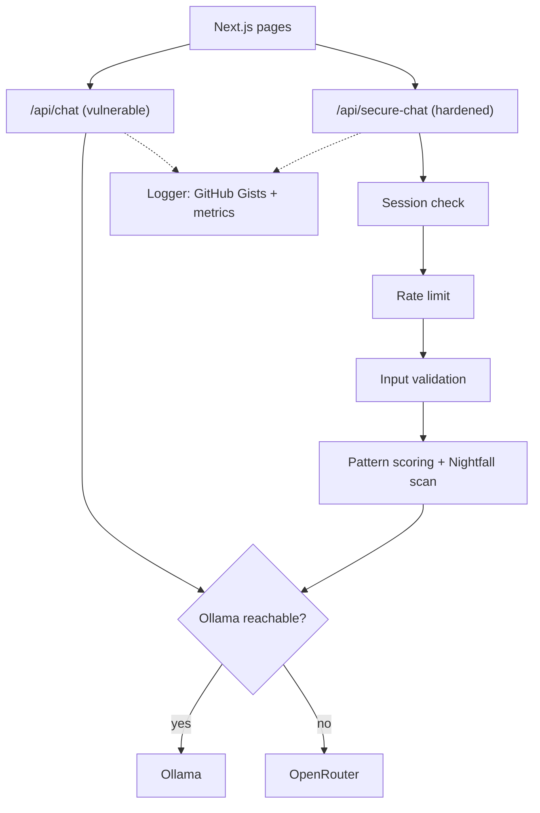

# Local LLM Security

A side-by-side lab of a deliberately vulnerable LLM chat endpoint and a hardened one, built to show how common attacks against locally hosted language models work and which controls stop them.

Group research project, Fontys University of Applied Sciences (cybersecurity specialisation, 2025). Write-up: [Teaching a chatbot to say no](https://nb.nb-limited.com/writing/teaching-a-chatbot-to-say-no)

## What it does

The app runs two chat endpoints against the same model (Gemma 3 1B on Ollama, with an OpenRouter fallback):

| Endpoint | Purpose |
|---|---|
| `/api/chat` | Intentionally vulnerable. No authentication, no rate limit, no input validation, client-chosen parameters passed straight to the model, a hardcoded fake key, verbose errors, and a system prompt that tells the model to comply with anything. |
| `/api/secure-chat` | The same chat behind layered controls (below). |

Pages:

- `/vulnerabilities`: five interactive attacks run against both endpoints: malicious prompt, prompt leakage, cross-site scripting through model output, overloading, and direct API access.
- `/secure-chat-demo`: chat UI for the hardened endpoint.
- `/monitoring`: request, error and security-event metrics.

### Controls on `/api/secure-chat`

- **Authentication**: Google sign-in through NextAuth; requests without a session get `401`.
- **Rate limiting**: 15 requests per minute per IP, plus a burst rule (2 requests within 1 s). Offending IPs are blocked for 60 s. In-memory, so per instance.
- **Input validation**: message capped at 10,000 characters, model restricted to an allowlist, generation parameters clamped.
- **Prompt-attack detection**: weighted regex patterns for prompt injection, social engineering, harmful content, data extraction and jailbreak attempts, plus formatting heuristics. A risk score of 35 or more blocks the request.
- **Sensitive-data scan**: the prompt is checked with the Nightfall API for SSNs, card numbers, email addresses, phone numbers, API keys, passwords in code, driver's licence and passport numbers.
- **Request timeout**: 60 s, via `AbortController`.
- **Audit logging**: authentication, chat and security events, written to GitHub Gists (console fallback when no token is set).

Metrics are exposed in Prometheus format at `/api/metrics/prometheus`, authorised by `GRAFANA_API_KEY` or a signed-in session. Example Grafana and Prometheus config is in [`grafana-config-examples/`](grafana-config-examples/).

## Quickstart

Requires Node.js 18+ and either [Ollama](https://ollama.com) or an OpenRouter API key.

```bash
git clone https://github.com/nbaburov/local-llm-security.git
cd local-llm-security
npm install
cp .env.example .env.local   # fill in what you need, see Configuration
ollama pull gemma3:1b        # if using Ollama
npm run dev                  # http://localhost:3000
```

Run it locally only. `/api/chat` is an open, jailbroken model endpoint by design: do not deploy it to a public URL.

## Architecture




Stack: Next.js 15 (App Router), React 19, TypeScript, Tailwind CSS 4, NextAuth 4, prom-client.

## Configuration

All variables go in `.env.local`. See [`.env.example`](.env.example).

| Variable | Needed for | Description |
|---|---|---|
| `OLLAMA_URL` | model | Ollama chat endpoint, e.g. `http://localhost:11434/api/chat` |
| `OPENROUTER_API_KEY` | model fallback | Used when Ollama is unreachable |
| `SITE_URL`, `SITE_NAME` | model fallback | Sent to OpenRouter as referer and title |
| `GOOGLE_CLIENT_ID`, `GOOGLE_CLIENT_SECRET` | secure chat | Google OAuth client |
| `NEXTAUTH_SECRET` | secure chat | Session signing secret (`openssl rand -hex 32`) |
| `NIGHTFALL_API_KEY` | secure chat | Sensitive-data scan; skipped with a logged error when unset |
| `GRAFANA_API_KEY` | metrics | Bearer key for `/api/metrics` and `/api/metrics/prometheus` |
| `GITHUB_TOKEN` | logging | Token with `gist` scope; without it logs go to the console |
| `GITHUB_GIST_API`, `GITHUB_GIST_AUTH`, `GITHUB_GIST_CHAT`, `GITHUB_GIST_ERROR`, `GITHUB_GIST_GENERAL` | logging | Gist IDs per log stream |

Gist logging setup: [`GITHUB_GIST_LOGGING_SETUP.md`](GITHUB_GIST_LOGGING_SETUP.md).

## Status

Finished university project, frozen at the June 2025 hand-in plus later dependency and documentation updates. It is not deployed anywhere and receives no feature work.

## Known issues

Carried over from the original project and left as they were:

- **Bans never lift.** The cleanup job resets each entry's timestamp before the blacklist check reads it, so a banned IP stays banned until the server restarts (`src/app/api/secure-chat/route.ts`).
- **Rate limits trust `X-Forwarded-For`.** The client IP is read from that header, so a caller can rotate it to dodge the limit and the ban.
- **Any Google account can sign in.** The `signIn` callback logs the attempt and always allows it; there is no allowlist (`src/lib/auth.ts`).
- **Logs are open to any signed-in user.** `/api/logs` checks only that a session exists, not who it belongs to.
- **The prompt-leakage demo is simulated.** Both endpoints are stateless, so the second session's answer is scripted to show what a leak looks like.
- **Prompts leave the machine on the secure path.** The Nightfall scan sends the prompt and the answer to Nightfall's cloud, and when Ollama is unreachable both endpoints fall back to OpenRouter.

## Authors

N. B., D. N., J. M., M. M., A. M. (Fontys University of Applied Sciences).

## License

Source-available under the [PolyForm Noncommercial License 1.0.0](LICENSE). You may read, run, modify and share it for any noncommercial purpose, as long as the copyright notice comes along.

This repository is a showcase, so it doesn't take issues or pull requests. Forks are welcome under the license. Commercial use needs a separate paid license; contact [NB Limited](https://nb-limited.com).
